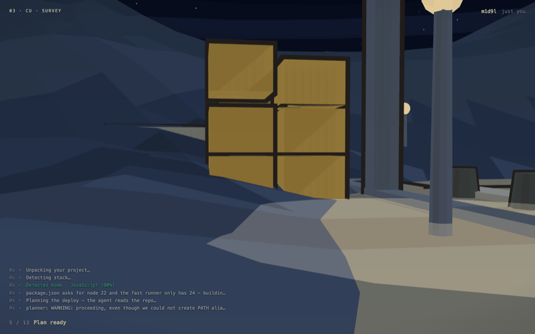
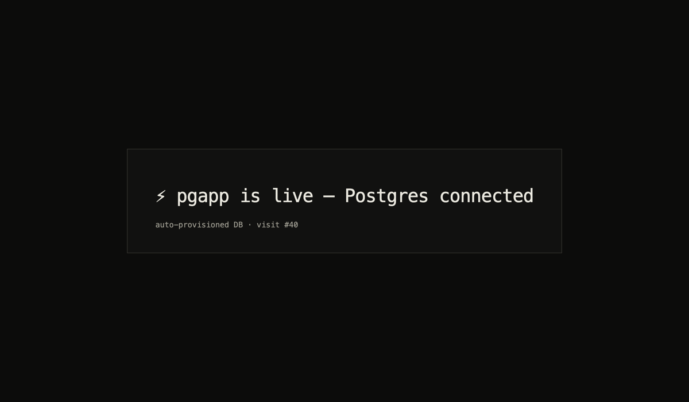

<div align="center">


**Bay — the cloud for the agentic era.**

You don't pick a database, a region, or an instance size. Your coding agent and Bay
work that out, ship it to a real address, and keep it alive.

[](https://www.npmjs.com/package/@thebaycloud/cli)
[](https://www.npmjs.com/package/@thebaycloud/cli)
[](LICENSE)

[**thebay.cloud**](https://thebay.cloud) · [Templates](https://thebay.cloud/templates) · [Changelog](https://thebay.cloud/changelog)

<br>

[](https://raw.githubusercontent.com/thebaycloud/bay/main/README.md)

<sub>Paste that link into Claude Code, Cursor, Codex or Copilot and say "set this up".
No account, no dashboard step, no keys to find first — the agent reads the manual at
[thebay.cloud/llms.txt](https://thebay.cloud/llms.txt) and drives the rest.</sub>

```bash
npm install -g @thebaycloud/cli && bay ship
```

</div>

---

## Ship anything in one CLI command



<sup>Recorded from a real `bay ship --wait`. Nothing is re-enacted — the app is
[`examples/pgapp`](examples/pgapp), and it is still up.</sup>

Point Bay at a folder or a repository. It reads the code, works out how to build it,
provisions the database and storage the code implies, injects the credentials, and
serves the result on a real address with a certificate. Next, Django, Rails, Go,
Phoenix, or anything that can be put in a container.

There is no configuration step you have to get through first. `examples/pgapp`
contains no Dockerfile, no infrastructure, and no mention of a database — just
`require("pg")` and a `DATABASE_URL` it expects somebody else to set. That
dependency is the request; Bay reads it, provisions Postgres, isolates it, and
fills the variable in.

**The shape of it.** One control plane decides, and nothing pushes to a machine:

```
     you  ·  your coding agent
              │  CLI · GitHub push · git URL
              ▼
       control plane            resolve the config, plan the build, provision
              │
     ┌────────┴────────┐
     ▼                 ▼
  the fleet         static apps
  one sandbox       published to a bucket
  per app, a
  resident agent
  pulling desired
  state
              │
              ▼
   load balancer ◄── wildcard DNS + SSL
```

Each node pulls its desired state, compares it to what is running, and makes the
difference go away. That single loop is the whole runtime — which is why a node
that falls behind catches up on its own rather than needing anybody to reach into
it. Images are built on the fleet's own BuildKit, whose cache is local to the node
and stays warm, and are deployed **by digest**, so "the new version" is a fact
rather than a tag.

## Star the Repository

If Bay is useful to you, a star is the cheapest way to say so — and the thing that
decides whether the next person finds it.

<div align="center">

</div>

<sup>That is not a marketing animation — it is what your app's own URL serves while
it is still being built. Frames from one real build at `m1d9l.thebay.cloud`: the log
along the bottom is that build's own output and the counter is its real stage. Only
the owner sees it. Send the link to anybody else and they get a page with no build
on it.</sup>

## Quickstart

```bash
npm install -g @thebaycloud/cli
cd your-project
bay ship --wait
```

The first run opens a browser once so you can sign in; after that the token is on
disk and your agent inherits it. Without `--wait`, `ship` returns as soon as the URL
is live and the build continues behind it; with `--wait` it stays attached and
streams the build to completion, which is the mode to give an agent that needs to
know the deploy finished before it does anything else.

Two commands worth knowing before the first ship, because both are local — no
cloud, no build, about two seconds each:

```bash
bay init     # writes a draft supersonic.json, and names what it could NOT determine
bay check    # resolves and validates that file exactly as a deploy would
```

`bay init` prints its open questions rather than guessing at them — which service
owns `/`, whether a migration runs before traffic, which env names are secrets.
None of those are answerable from files, and a guess would be indistinguishable
from a decision.

## Builds every service

Postgres, MySQL, Mongo and Redis come up with your app, picked from what your code
already imports. Object storage sits behind a CDN. Workers and cron run beside the
web process, and a `release` phase runs before any traffic reaches it. You
provision none of it.



The result of that pgapp deploy is live right now, and you can open it:
**[xf4u7.thebay.cloud](https://xf4u7.thebay.cloud)**



| | |
|---|---|
| **Database** | Postgres / MySQL / Mongo / Redis, picked from your ORM |
| **Auth** | end-user auth, owned by your app |
| **Storage** | object storage behind a CDN |
| **Secrets** | the only thing we ever ask you for |
| **Jobs** | `release` before traffic, `worker` and `cron` alongside it |
| **Domains** | `*.thebay.cloud` immediately, your own when you point it |
| **Analytics** | who's in the app, embedded |
| **Backups** | daily, with restore |

## Hands your agent bug fixes

Bay watches the app after it is live. When something breaks in production, it reads
the logs and the repository together and returns an instruction written for the
thing that wrote the code:

```bash
bay errors <app>     # production errors, last 7 days
bay diagnose <app>   # a fix prompt, ready to paste into your coding agent
```

`diagnose` does not print a stack trace and leave you to it. It prints the actual
sentence — *migrations never ran, so the schema is empty; add a release step that
runs them before the web process starts, then deploy again* — because a trace is
the symptom and the agent needs the cause.

## MCP and CLI instead of a dashboard

Everything the dashboard does, the CLI does, and every command takes `--json`:

```bash
bay apps                          # everything you have shipped
bay status <app>                  # revision, url, env, database
bay logs <app> --follow           # what production actually saw, live
bay share <app> add ada@acme.com  # let one person in, or a whole domain
bay domains <app> add acme.com    # a domain you own, and the record to create
bay db <app> --sql "select ..."   # its tables, row counts, one read-only statement
bay exec <app> -- <command>       # run something in the app's environment
bay rollback <app>                # back to the version that worked
bay env <app> set KEY=VALUE       # secrets, never in the code
```

`bay help --all` lists the rest. Anything that can run a command can run your
infrastructure — which is the point, because the thing running commands is usually
not a person any more.

**MCP is next.** Your agent will call Bay as tools instead of shelling out —
deploy, read the logs, apply a fix, without leaving the editor it is already in.
Not shipped yet, and labelled that way here for the same reason it is labelled that
way on the site.

## Self-host something you already use

Bay runs software you did not write as happily as software you did, and
**self-hosting a public repository is free for the first year.**

The [templates](https://thebay.cloud/templates) — Excalidraw, Open WebUI, Cal.com —
are prompts rather than buttons. You copy one, your agent reads it, clones the
source and ships it. No form and no dashboard step, since the agent is already
holding everything the deploy needs.

Each template page says up front what gets provisioned, which secrets are generated
for you, and the one or two only you can supply. A one-click deploy that then
demands a Google OAuth client is worse than a page that warned you.

<br>

---

<div align="center"><sub><b>Everything below is how it is built.</b><br>
Nothing above needs it.</sub></div>

---

## Read this before cloning

**This repository is open to read, not yet to run.** Bay is welded to one Google
Cloud project — Cloud Run, Cloud SQL, Cloud Build, Certificate Manager, Artifact
Registry, Secret Manager and Compute for the fleet — not as configuration you could
point elsewhere, but as the assumption underneath the code. There is no
`docker compose up` and no local mode.

You can read every line and run the test suites. You cannot stand up your own copy
without a GCP project, billing, and a day of work nobody has written down yet. That
is said here rather than discovered after a clone. If self-hosting Bay itself
matters to you, [open an issue](https://github.com/thebaycloud/bay/issues) — it is
a question of demand, not of principle.

## Repository

| Path | What it is |
|---|---|
| `apps/web` | **The control plane.** API, dashboard, deploy pipeline, build orchestration, billing, GitHub integration. Next.js 14 · Postgres · NextAuth. Every decision the platform makes happens here — including `lib/buildplane.ts`, which drives BuildKit |
| `apps/landing` | [thebay.cloud](https://thebay.cloud) — the marketing site, changelog, self-host templates, and `/llms.txt`, the manual coding agents read |
| `packages/cli` | `bay` — the CLI on npm ([MIT](packages/cli/LICENSE)) |
| `packages/detector` | The stack detector. One implementation, compiled into the CLI at publish time so the CLI and the server cannot disagree about what a project is |
| `packages/prompts` | The rules handed to coding agents. One source, copied into each app by `scripts/sync-prompt-rules.mjs` |
| `services/fleet` | `supersonicd` — the Go agent on each VM: reconcile loop, sandboxes, router. Plus the node image and `fleetctl.sh` |
| `services/proxy` | The front door. Resolves a hostname to an app, decides who may open it, and serves the Room |
| `services/static` | Serves static apps out of a bucket |
| `services/screenshots` | One screenshot per app after it deploys, for the dashboard |
| `scripts/` | The GCP setup scripts — the domain, the deploy worker, the deploy job, BuildKit provisioning |
| `examples/` | Small apps used as deploy fixtures, including ones that are broken on purpose |
| `adrs/` | Where a contribution starts. See [CONTRIBUTING.md](CONTRIBUTING.md) |
| `docs/` | [`ARCHITECTURE.md`](docs/ARCHITECTURE.md), [`VM-FLEET.md`](docs/VM-FLEET.md), and the [ADRs](docs/adr) |

Two documents are worth reading before you change anything:

- [`CONTEXT.md`](CONTEXT.md) — the vocabulary. There are two languages here,
  platform and product, and they do not mix. A word in the wrong one is a bug.
- [`AGENTS.md`](AGENTS.md) — how agents work in this repo: the issue tracker,
  the triage labels, where domain docs live.

## Local development

```bash
git clone https://github.com/thebaycloud/bay.git && cd bay
```

The control plane talks to two Cloud SQL instances — its own tables on one,
every app's database on the other — so running `apps/web` against real data means
one `cloud-sql-proxy` per instance:

```bash
cloud-sql-proxy -g --port 5433 <project>:<region>:supersonic-platform-pg
cloud-sql-proxy -g --port 5434 <project>:<region>:supersonic-shared-pg
```

```bash
cd apps/web
npm install
npm run dev        # http://localhost:3000
npm test
npm run lint
npm run deadcode   # knip
```

Migrations in `apps/web/db/*.sql` are applied deliberately, never automatically:

```bash
npm run db:migrate
```

> **Careful:** never run the `apps/web` suite under `git bisect run` — the
> fixtures write into the real `.git`.

**No GCP account?** Most of the repo doesn't need one. The CLI, the fleet agent
and the fixtures all build and test on their own:

```bash
cd packages/cli         && npm install && npm test
cd services/fleet/agent && go build ./... && go test ./...
cd apps/landing         && npm install && npm run dev
```

CI runs all of it on every pull request.

## Contributing

**We take contributions as human-written text, not code** — see
[CONTRIBUTING.md](CONTRIBUTING.md). Describe the change you would like informally
in a `.txt` or `.md` file in [`adrs/`](adrs/) and open a pull request with just
that file. If we are aligned, we handle the implementation.

That is not a filter on your writing. A change to the deploy pipeline, the edge, or
the fleet agent lands on live tenant applications minutes after it merges, and
reviewing a patch against that costs more than reading a paragraph does.

Bugs are [issues](https://github.com/thebaycloud/bay/issues). Vulnerabilities are
private — [SECURITY.md](SECURITY.md), never a public issue. Before writing anything
here, read [`CONTEXT.md`](CONTEXT.md) and match the vocabulary.

## License

[AGPL-3.0](LICENSE), except `packages/cli`, which is [MIT](packages/cli/LICENSE)
so it can be installed anywhere without pulling its licence along.
